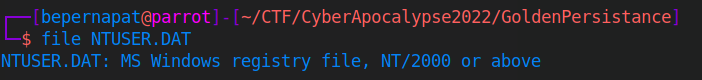
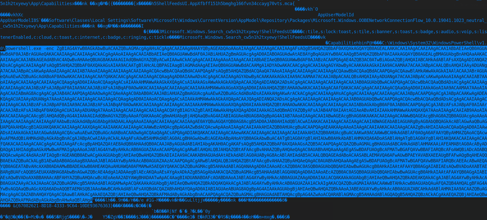
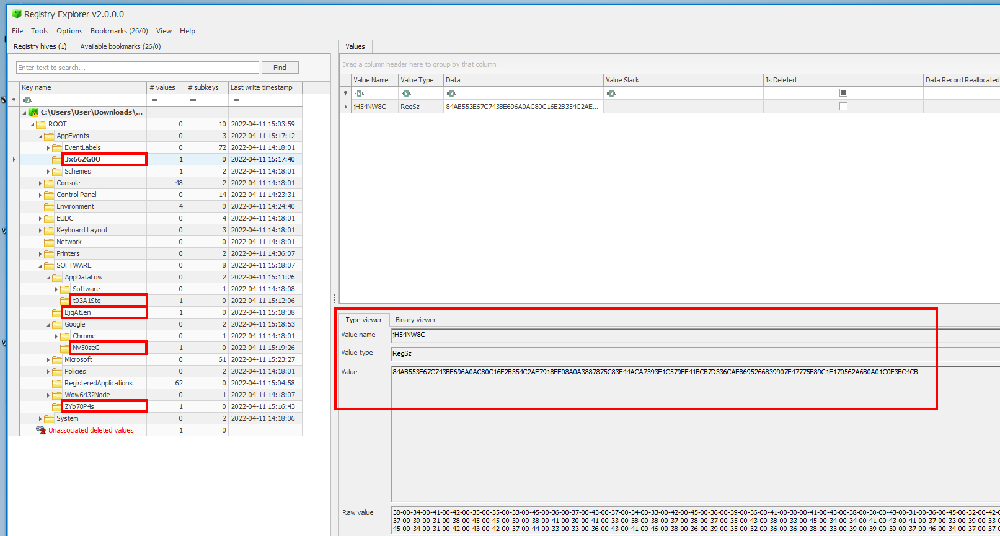
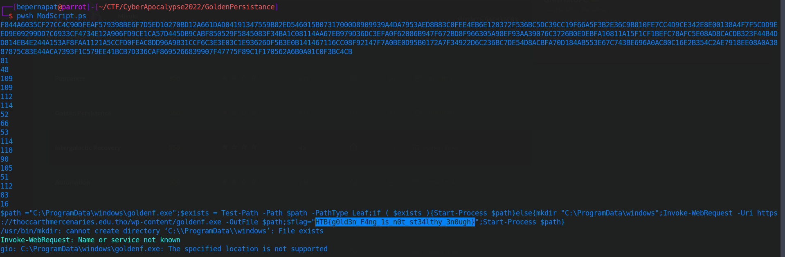

# FORENSICS - GOLDEN PERSISTANCE

In this challenge we are given a MS Windows registry file called NTUSER.DAT


	file NTUSER.DAT


To take a first approach to this challenge, I thought the best idea would be to cat the file so, that's what I did.

	cat NTUSER.DAT	


If we scroll up a bit, we will be able to see what seems to be a base64 encoded Powershell command:



Then we can proceed to decode it. To achieve this goal, we can use the following:

	echo "base64_encoded_string" | base64 -d


The output consists in a little Powershell script. Even though the format is not very good, at the last part of the script we can see that it takes some values from the MS registry file and concatenates them. Later it tries to decrypt the sequence.

```powershell
function encr {
    param(
        [Byte[]]$data,
        [Byte[]]$key
      )
 
    [Byte[]]$buffer = New-Object Byte[] $data.Length
    $data.CopyTo($buffer, 0)
    
    [Byte[]]$s = New-Object Byte[] 256;
    [Byte[]]$k = New-Object Byte[] 256;
 
    for ($i = 0; $i -lt 256; $i++)
    {
        $s[$i] = [Byte]$i;
        $k[$i] = $key[$i % $key.Length];
    }
 
    $j = 0;
    for ($i = 0; $i -lt 256; $i++)
    {
        $j = ($j + $s[$i] + $k[$i]) % 256;
        $temp = $s[$i];
        $s[$i] = $s[$j];
        $s[$j] = $temp;
    }
 
    $i = $j = 0;
    for ($x = 0; $x -lt $buffer.Length; $x++)
    {
        $i = ($i + 1) % 256;
        $j = ($j + $s[$i]) % 256;
        $temp = $s[$i];
        $s[$i] = $s[$j];
        $s[$j] = $temp;
        [int]$t = ($s[$i] + $s[$j]) % 256;
        $buffer[$x] = $buffer[$x] -bxor $s[$t];
    }
 
    return $buffer
}


function HexToBin {
    param(
    [Parameter(
        Position=0, 
        Mandatory=$true, 
        ValueFromPipeline=$true)
    ]   
    [string]$s)
    $return = @()
    
    for ($i = 0; $i -lt $s.Length ; $i += 2)
    {
        $return += [Byte]::Parse($s.Substring($i, 2), [System.Globalization.NumberStyles]::HexNumber)
    }
    
    Write-Output $return
}

[Byte[]]$key = $enc.GetBytes("Q0mmpr4B5rvZi3pS")
$encrypted1 = (Get-ItemProperty -Path HKCU:\SOFTWARE\ZYb78P4s).t3RBka5tL
$encrypted2 = (Get-ItemProperty -Path HKCU:\SOFTWARE\BjqAtIen).uLltjjW
$encrypted3 = (Get-ItemProperty -Path HKCU:\SOFTWARE\AppDataLow\t03A1Stq).uY4S39Da
$encrypted4 = (Get-ItemProperty -Path HKCU:\SOFTWARE\Google\Nv50zeG).Kb19fyhl
$encrypted5 = (Get-ItemProperty -Path HKCU:\AppEvents\Jx66ZG0O).jH54NW8C
$encrypted = "$($encrypted1)$($encrypted2)$($encrypted3)$($encrypted4)$($encrypted5)"
$enc = [System.Text.Encoding]::ASCII
[Byte[]]$data = HexToBin $encrypted
$DecryptedBytes = encr $data $key
$DecryptedString = $enc.GetString($DecryptedBytes)
$DecryptedString|iex
```

At this point, I spent some time trying to find a way to read these values. After a while, I found a tool called [Registry Explorer](https://ericzimmerman.github.io/#!index.md) from Eric Zimmerman. As this tool only works on Windows, I opened a Windows virtual machine to run it.

As we can see, once the file is opened, getting the values is pretty straight forward.



Now we only need to modify the given script and fix a few things.
After some debugging we finally obtain the following:

```powershell
function encr {
    param([Byte[]]$data,[Byte[]]$key)

    [Byte[]]$buffer = New-Object Byte[] $data.Length
    $data.CopyTo($buffer, 0)

    [Byte[]]$s = New-Object Byte[] 256;
    [Byte[]]$k = New-Object Byte[] 256;

    for ($i = 0; $i -lt 256; $i++)
    {
        $s[$i] = [Byte]$i;
        $k[$i] = $key[$i % $key.Length];
    }

    $j = 0;
    for ($i = 0; $i -lt 256; $i++)
    {
        $j = ($j + $s[$i] + $k[$i]) % 256;
        $temp = $s[$i];
        $s[$i] = $s[$j];
        $s[$j] = $temp;
    }

    $i = $j = 0;
    for ($x = 0; $x -lt $buffer.Length; $x++)
    {
        $i = ($i + 1) % 256;
        $j = ($j + $s[$i]) % 256;
        $temp = $s[$i];
        $s[$i] = $s[$j];
        $s[$j] = $temp;
        [int]$t = ($s[$i] + $s[$j]) % 256;
        $buffer[$x] = $buffer[$x] -bxor $s[$t];
    }

    return $buffer
}


function HexToBin {
    param([Parameter(Position=0,Mandatory=$true,ValueFromPipeline=$true)][string]$s)
    $return = @()

    for ($i = 0; $i -lt $s.Length ; $i += 2)
    {
        $return += [Byte]::Parse($s.Substring($i, 2), [System.Globalization.NumberStyles]::HexNumber)
    }

    Write-Output $return
}

$encrypted1 = "F844A6035CF27CC4C90DFEAF579398BE6F7D5ED10270BD12A661DAD04191347559B82ED546015B07317000D8909939A4DA7953AED8B83C0FEE4EB6E120372F536BC5DC39"
$encrypted2 = "CC19F66A5F3B2E36C9B810FE7CC4D9CE342E8E00138A4F7F5CDD9EED9E09299DD7C6933CF4734E12A906FD9CE1CA57D445DB9CABF850529F5845083F34BA1"
$encrypted3 = "C08114AA67EB979D36DC3EFA0F62086B947F672BD8F966305A98EF93AA39076C3726B0EDEBFA10811A15F1CF1BEFC78AFC5E08AD8CACDB323F44B4D"
$encrypted4 = "D814EB4E244A153AF8FAA1121A5CCFD0FEAC8DD96A9B31CCF6C3E3E03C1E93626DF5B3E0B141467116CC08F92147F7A0BE0D95B0172A7F34922D6C236BC7DE54D8ACBFA70D1"
$encrypted5 = "84AB553E67C743BE696A0AC80C16E2B354C2AE7918EE08A0A3887875C83E44ACA7393F1C579EE41BCB7D336CAF8695266839907F47775F89C1F170562A6B0A01C0F3BC4CB"
$encrypted = "$($encrypted1)$($encrypted2)$($encrypted3)$($encrypted4)$($encrypted5)"
Write-Output $encrypted
$enc=[System.Text.Encoding]::ASCII
[Byte[]]$key = $enc.GetBytes('Q0mmpr4B5rvZi3pS')
Write-Output $key
Write-Output $key.Length
[Byte[]]$data = HexToBin  $encrypted
$DecryptedBytes= encr $data $key
$DecryptedString = $enc.GetString($DecryptedBytes)
Write-Output $DecryptedString
$DecryptedString|iex

```

Running this modified script eventually gives us the flag!


